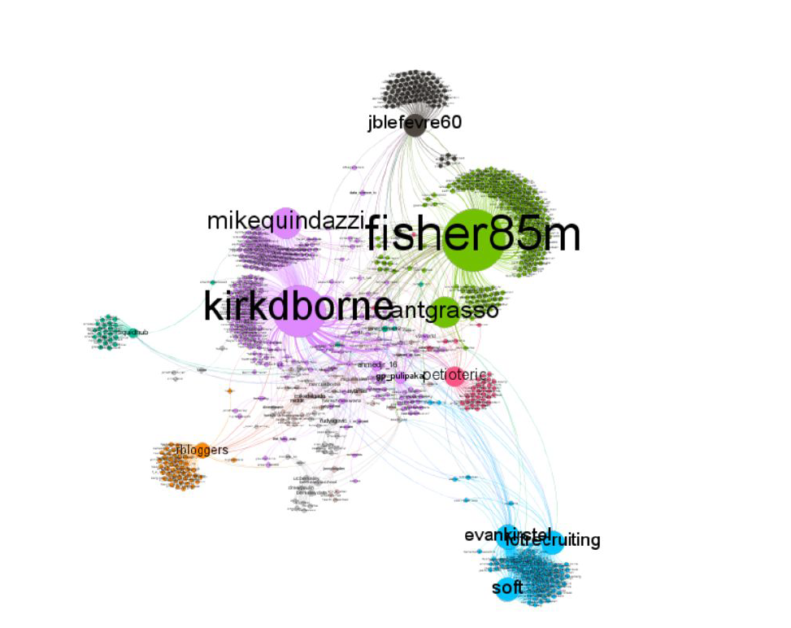

# Analyzing and Visualising Twitter Network 
The repo contains Master Course Work project report of defining a twitter conversation, extract a set of tweets on a chosen subject (#DataScience), build the graph which models a conversations & analyzing the structure. 

The conversational graph structure represents how users are interacting within the network in the form of nodes and edges. 

#### The work was supervised by Prof. Pascale KUNTZ-COSPEREC, LS2N, Nantes, France.  

(http://theodi.fbk.eu/openbigdata/)

